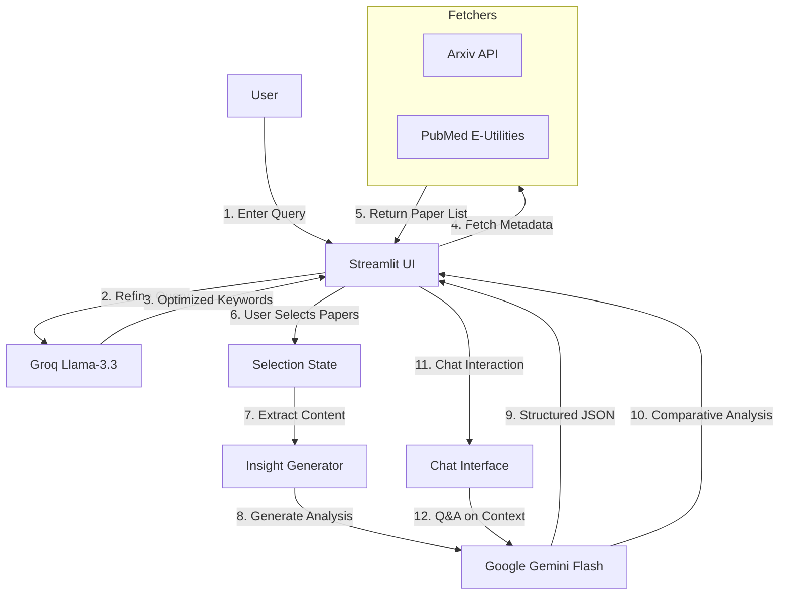

# Life Sciences Research Agent - Project Documentation

## 1. Project Overview
The **Life Sciences Research Agent** is an AI-powered application designed to accelerate literature review. It allows researchers to search for scientific papers across **Arxiv** and **PubMed**, select relevant studies, and generate structured insights and comparative analyses using advanced Large Language Models (LLMs).

## 2. Directory Structure
```
MultimodalRag-main/
├── app_streamlit.py       # Main Application Entry Point (UI & Logic)
├── setup_and_run.bat      # Windows Batch Script for Setup & Execution
├── requirements.txt       # Python Dependencies
├── .env                   # Environment Variables (API Keys)
├── src/                   # Source Code Module
│   ├── arxiv_fetcher.py   # Module for fetching papers from Arxiv
│   ├── pubmed_fetcher.py  # Module for fetching papers from PubMed
│   └── insight_generator.py # Module for LLM-based analysis
└── README.md              # Original Readme
```

## 3. Architecture & Code Flow

### Architecture Style: **Agentic Search & Synthesis**
This application follows a **Real-time Retrieval-Augmented Generation (RAG)** pattern. Unlike traditional RAG which queries a static vector database, this agent performs live retrieval from external scientific databases (Arxiv/PubMed) and uses an LLM to synthesize the retrieved context on demand.

### Code Flow Diagram


## 4. Models & APIs Used

### Large Language Models (LLMs)
1.  **Google Gemini Flash (gemini-flash-latest)**:
    *   **Role**: Core analysis engine. Used for generating structured summaries (Background, Methods, Results), comparative synthesis, and answering chat questions.
    *   **Reason**: High speed, large context window (essential for reading multiple abstracts), and strong reasoning capabilities.

2.  **Groq (Llama-3.3-70b-versatile)**:
    *   **Role**: Query refinement. Converts natural language user queries into precise scientific keywords.
    *   **Reason**: Extremely low latency, ensuring the search experience feels instantaneous.

### External APIs
1.  **Arxiv API**: Accessed via `arxiv` Python library. Provides metadata and links for preprints in physics, computer science, and biology.
2.  **PubMed E-Utilities**: Accessed via `pubmed_sdk` (and custom parsing). Provides access to over 36 million citations for biomedical literature.

## 5. Dependencies
*   `streamlit`: Web framework for the user interface.
*   `google-generativeai`: SDK for Google Gemini models.
*   `groq`: SDK for Groq API.
*   `arxiv`: Wrapper for Arxiv API.
*   `pubmed_sdk`: Wrapper for PubMed searches.
*   `python-dotenv`: Management of environment variables.

## 6. Scope & Functionality

### Core Features
*   **Multi-Source Search**: Unified search across Arxiv and PubMed.
*   **Query Optimization**: AI-assisted conversion of vague queries into targeted keywords.
*   **Paper Selection**: Interactive UI to review search results and select specific papers for deep dive.
*   **Structured Insights**: Automatic generation of "Background", "Methods", "Results", "Conclusions", "Key Findings", and "Rigor Score" for each paper.
*   **Comparative Synthesis**: If multiple papers are selected, generates a comparison table of methodologies and hypotheses.
*   **Context-Aware Chat**: Users can ask follow-up questions specifically about the selected papers.
*   **Export**: One-click download of analysis in JSON format.

### Constraints
*   **Full Text Access**: Currently relies primarily on abstracts due to paywalls and varying formats of full-text PDFs.
*   **Rate Limits**: Subject to API rate limits of Arxiv, PubMed, and LLM providers.

## 7. RAG Architecture Details
The application implements a **Just-in-Time RAG** workflow:
1.  **Retrieval**: Instead of pre-indexing, retrieval happens at query time via APIs.
2.  **Context Construction**: The abstracts of selected papers are concatenated to form a dynamic context window.
3.  **Generation**: The LLM uses this specific context to answer questions, ensuring answers are grounded in the selected literature and not just general knowledge.
