# 📄 Document Chat Assistant

## Overview

**Document Chat Assistant** is an AI-powered web app that lets you interact with uploaded research papers and PDFs using natural language queries. Whether it's extracting summaries, understanding formulas, or comparing multiple documents — this assistant uses the power of **Mistral OCR** and **LLMs** to help you make sense of academic documents.

## Features

- 💬 **Real-time Chat Interface**: Ask questions like you're chatting with ChatGPT.
- 📂 **Upload Your PDFs**: Load multiple PDFs from your local system.
- 🔍 **Search & Load from arXiv**: Fetch academic papers directly via keyword or arXiv ID.
- 🧠 **AI-Powered Reasoning**: Uses Mistral’s OCR and LLMs to extract and analyze document content.
- 🧮 **Math Formula Rendering**: Detects and renders LaTeX math equations clearly.
- 🖼️ **Image Extraction**: Automatically detects and preserves image content from documents.
- 🌙 **Dark-Themed UI**: Clean, responsive layout optimized for focus and readability.

## Technologies Used

- **Frontend**: Streamlit, HTML/CSS
- **Backend & Logic**: Python, LangChain
- **LLMs**: Mistral (OCR & chat models)
- **PDF Handling**: Mistral OCR API
- **Search API**: arXiv Python library
- **Environment Management**: python-dotenv

---

## Setup Instructions

### Prerequisites

- Python 3.8+
- pip or conda
- Mistral API Key (Sign up on [mistral.ai](https://mistral.ai))

### Installation

1. **Clone the Repository**
   ```sh
   git clone https://github.com/your-username/document-chat-assistant.git
   cd document-chat-assistant

2. **Install Python Dependencies**
   ```sh
   pip install -r requirements.txt
3. **Create a .env File Add your Mistral API key:**
   ```env
   MISTRAL_API_KEY=your_mistral_api_key_here
4. **Run the Application**
   ```sh
   streamlit run app.py
5. **Open in Browser Navigate to http://localhost:8501 in your browser.**

   ## 📖 Usage

1. **Upload PDF Documents** using the file uploader available in the sidebar.

2. **Search arXiv** by specifying keywords, author name, or arXiv ID, and select relevant research papers to include.

3. Click on **“Process All Documents”** to perform OCR and generate structured content from your documents and papers.

4. Once the documents are processed, interact with them using the chat interface. Example queries include:
   - _“Summarize this research paper.”_
   - _“What are the key contributions of this work?”_
   - _“Please explain the self-attention formula.”_
   - _“Compare the methodologies across the selected papers.”_
   - _“What are the main experiments and their outcomes?”_

---

## 🧱 System Architecture

### Frontend
- Built with **Streamlit** for an intuitive and responsive web interface
- Incorporates a ChatGPT-style layout with a dark theme for improved readability and usability

### Backend
- **Mistral OCR API** for advanced document structure recognition and text extraction
- **Mistral LLM** for reasoning and natural language question-answering
- **LangChain** for document embedding and vector-based search
- **arXiv API** for fetching publicly available scholarly papers

---

## 🔁 Data Flow

```mermaid
flowchart TD
    A[User Uploads PDFs or Retrieves Papers from arXiv] --> B[Document Staging]
    B --> C[Text Extraction via Mistral OCR]
    C --> D[Markdown Content Generation]
    D --> E[Vector Embedding with LangChain]
    E --> F[Stored in In-Memory Vector DB]
    F --> G[User Query → LLM → Context-Aware Answer]

```


## 📄 License

This project is licensed under the **MIT License**.  
See the [LICENSE](LICENSE) file for more details.

---

## 🙌 Acknowledgements

- **[Mistral AI](https://mistral.ai)** – for providing powerful OCR and reasoning models  
- **[LangChain](https://www.langchain.com/)** – for embedding, retrieval, and vector store capabilities  
- **[arXiv.org](https://arxiv.org/)** – for offering free and open access to scholarly literature  
- **[Streamlit](https://streamlit.io)** – for simplifying interactive UI development  
- Appreciation to the broader **open-source community** for tools and inspiration that made this project possible

### 🖼️ User Interface Preview

| Upload & Search Sidebar | arXiv Search Results |
|--------------------------|----------------------|
|  |  |

| Chat with Assistant | Image Reasoning via Chat |
|---------------------|--------------------------|
|  |  |

## 🤝 Feedback & Contributions

We welcome contributions that improve the usability, functionality, or documentation of this project.

- 💡 Found a bug or want a feature? [Open an issue](https://github.com/AshayChaudhari-6113/MultimodalRag/issues)
- 🔧 Want to contribute code? Fork the repo, make changes, and submit a pull request.
- 📧 Have suggestions or feedback? Feel free to reach out or comment in issues.

> Let's collaborate to make this tool more useful for everyone!

---

### ❤️ Built with Passion by [Ashay Chaudhari](https://www.linkedin.com/in/ashay-chaudhari-47ba61209/)

If you found this project helpful, please ⭐ star the repository and consider sharing it with others.

Stay curious. Keep building. 🚀

